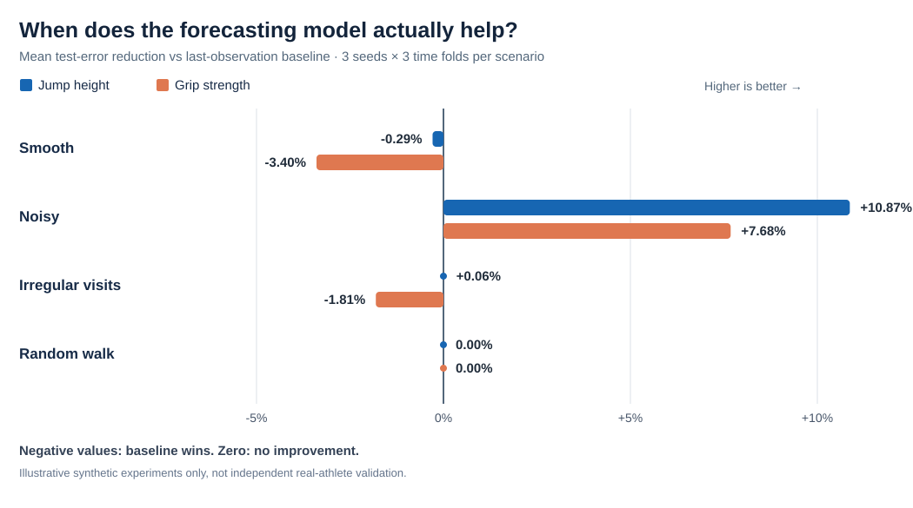

# Athlete Performance Intelligence

**Independent computer-science / applied-ML research prototype** — built to demonstrate data engineering, longitudinal forecasting, anomaly detection, and rigorous evaluation. This is **not** part of TMX's production system.

> **Data integrity:** The included demonstration is 100% synthetic. There is no real athlete data, no injury prediction, no invented validation claim and no connection to TMX's database. Do not claim the included synthetic performance figures demonstrate real-world predictive ability.

## What it does

1. Generates fictional longitudinal test results for 120 athletes across 32 weeks in two measurement protocols: countermovement jump (cm) and grip strength (kg).
2. Builds strictly historical features: three preceding results, previous-three-session mean/standard deviation, preceding change, days since last test and session number. Every feature for session *t* is based on sessions *before t*.
3. Evaluates one-step-ahead forecasting with **chronological train/validation/test splits**. Benchmarks persistence (use the previous result), a simple recent average, regularized linear regression (Ridge), and histogram gradient boosting. Selects a method **only using validation performance**, evaluates on untouched later dates, and makes a per-test comparison.
4. Performs an additional **held-out-athlete test**, with no athlete identity shared across model training, validation and test; calculates **athlete-cluster bootstrap confidence intervals** around forecasting improvement.
5. Flags unusual drops using a transparent historical median/MAD rule, with an absolute drop threshold. Labels are **observational statistical flags**, not medical or injury classifications.
6. Generates an honest report, machine-readable predictions and charts.

## Reproducible results at a glance

The fixed-seed demonstration uses **120 fictional athletes, 32 weekly sessions and two test types**. The model is selected on validation dates and evaluated on later, untouched test dates.

| Synthetic test | Selected forecasting method | Selected test MAE | Last-value baseline MAE | MAE reduction |
| --- | --- | ---: | ---: | ---: |
| Countermovement jump | Histogram gradient boosting | 0.7466 cm | 0.7998 cm | 6.65% |
| Grip strength | Histogram gradient boosting | 0.8670 kg | 0.9717 kg | 10.78% |

A separate disjoint-athlete evaluation chose Ridge and observed 5.68% (jump) and 5.84% (grip) lower synthetic-data MAE than persistence. Full evidence, uncertainty intervals, and limitations are in [the evaluation report](demo_results/EVALUATION_REPORT.md).

**Interpretation:** These numbers are illustrative outcomes on data generated with deliberately predictable patterns—not verified improvements on real athletes. The primary comparison is the validation-selected model against the last-value baseline. Other test-set model rows are exploratory train-only fits, not equal-training-data final rankings.

### Does the result survive different conditions?




Not reliably. An expanded **synthetic stress experiment** with three random seeds and three walk-forward test folds per scenario showed the following **mean percent change in MAE compared with persistence** (positive = improvement; negative = worse):

| Synthetic condition | Jump | Grip |
| --- | ---: | ---: |
| Smooth, smaller synthetic cohorts | **-0.29%** | **-3.40%** |
| Noisier measurements | +10.87% | +7.68% |
| Irregular / missed sessions | +0.06% | -1.81% |
| Independent random-walk changes | 0.00% | 0.00% |

The fixed-seed example above and this smaller-cohort multi-seed study use **different experimental designs**. The favorable first demo should **not** be presented as reliably replicated. See the [full stress-test findings, including negative outcomes](demo_results/STRESS_TEST_FINDINGS.md) and [aggregated CSV](demo_results/stress_summary.csv). These are only artificial cohorts; they say nothing yet about real-athlete prediction accuracy.

Re-run the stress experiment after installation:

~~~bash
athlete-insights evidence --out outputs/evidence --seeds 42 43 44 --athletes 48 --weeks 28 --folds 3
~~~

The command writes all chronological test boundaries, selected models, and per-athlete failure shares to the generated CSV rather than hiding unfavorable folds. It runs only when explicitly requested, not during routine tests or GitHub Actions.

## Start in five minutes

Python 3.10+ is required. In PowerShell:

```powershell
py -m venv .venv
.venv\Scripts\Activate.ps1
python -m pip install -e ".[dev]"
athlete-insights demo --out outputs/demo
pytest -q
```

macOS/Linux:

```bash
python3 -m venv .venv
source .venv/bin/activate
pip install -e '.[dev]'
athlete-insights demo --out outputs/demo
pytest -q
```

You can alternatively use `python -m athlete_insights demo` after installing.

### Demo outputs

- `outputs/demo/EVALUATION_REPORT.md` — outcomes, baselines, error metrics, methodology and limitations
- `outputs/demo/forecast_comparison.csv` — each model's holdout error and validation-selected model
- `outputs/demo/test_predictions.csv` — holdout predictions for each forecast method
- `outputs/demo/unusual_drop_flags.csv` — statistically unusual drops, with context
- `outputs/demo/athlete_held_out_comparison.csv` — accuracy on athletes excluded from model training
- `outputs/demo/athlete_bootstrap_intervals.csv` — uncertainty in improvements, resampling whole athletes
- `outputs/demo/splits.json` — dates and sizes of train/validation/test splits
- `outputs/demo/figures/*.png` — report-ready plots
- `outputs/demo/synthetic_sessions.csv` — clearly labeled fictional records

The repository includes a compact `demo_results/` evaluation report, model comparison CSVs, and split metadata from a fixed-seed **synthetic** run. Larger generated prediction files, the full synthetic session dataset, and PNG figures are not committed; reproduce those locally with `athlete-insights demo --out outputs/demo`.

## Running on real, authorized data later

Prepare a pseudonymized, long-format CSV (no names, DOBs, exact addresses, or contact information):

```csv
athlete_id,session_date,test_id,value,unit
P0001,2025-01-06,countermovement_jump,35.2,cm
P0001,2025-01-13,countermovement_jump,36.1,cm
P0001,2025-01-20,countermovement_jump,36.6,cm
```

Each `(athlete_id, test_id, session_date)` must be unique; separate metric types must not be mixed, and every `test_id` must consistently use one unit. Enough longitudinal data is necessary (at least 12 distinct feature-eligible dates and several athletes); otherwise evaluation will refuse to run.

```bash
athlete-insights analyze --csv path/to/authorized_deidentified_sessions.csv --out outputs/real
```

**Permissions:** Obtain explicit authorization and a lawful basis to use/export any athlete records. Client data stays out of this project until permission, consent, and appropriate privacy protections are in place. Pseudonyms alone do not necessarily make data anonymous. Do not commit real results/records to a public repository.

## Research question and evaluation design

**Question:** For sequential athlete-testing records, can a model predict the next observed measurement more accurately than a last-value baseline, and can historical deviations be surfaced transparently?

**Success criteria:** A model must demonstrate robust lower out-of-time error than simple baselines across meaningful data slices, not merely a high training R². Results on fictional trajectories only verify that the experimental pipeline works; a real-data test is necessary before making claims about utility.

### Threats to validity

- The generator embeds smooth trajectories, so apparent predictability is partly a property of how the data were synthesized.
- The test estimates *next-test* readings for repeatedly observed athletes. The separate held-out-athlete experiment probes new-athlete generalization; neither design evaluates long-horizon forecasts.
- Rolling evaluation uses actual earlier test-period observations as history. Those would be available at each real prediction time, but they are not available for forecasts made many weeks ahead.
- Session-level comparisons are descriptive, not diagnostic; sport, age, protocol and sample sizes matter.
- Test data are not used for feature selection or algorithm selection; synthetic data generation settings, however, are known to this project's author.
- Automated alerts need expert review, prospective validation and false-positive monitoring before any practical adoption.

## Repository organization

```text
src/athlete_insights/
  synthetic.py     # reproducible fictional data
  features.py      # data checks and no-lookahead features
  forecast.py      # baselines, models, chronological evaluation
  anomalies.py     # historical-only flags
  reporting.py     # written and visual artifacts
  cli.py           # repeatable CLI
 tests/            # leakage, validation, splits, end-to-end checks
 demo_results/     # generated synthetic demonstration (fixed seed)
```

## Next milestones

1. **Permissions + data contract:** Obtain consent/authorization for a de-identified export from real historical athlete tests, or find a legitimately licensed public longitudinal dataset.
2. **Rigorous out-of-athlete generalization:** Evaluate external public or authorized de-identified cohorts and additional calendar seasons; compare whether findings replicate.
3. **Explainability and error analysis:** Report results per metric, athlete cohort and testing frequency; document failure cases and uncertainty rather than only one overall metric.
4. **Optional TMX integration later:** Build a read-only CSV export adapter and keep all experimentation outside the client's application until they ask for it.

## Resume-safe description

**Athlete Performance Intelligence — Independent ML Research Prototype**  
*Python, Pandas, scikit-learn, data engineering, time-series evaluation*

> Developed a reproducible athlete-performance forecasting prototype using synthetic longitudinal data, historical feature engineering, chronological and athlete-held-out evaluation, bootstrap uncertainty analysis, and statistical unusual-drop detection. Compared regularized regression and gradient boosting against persistence and rolling-average baselines; documented model performance, data leakage controls and real-world limitations.

This is an accurate technical description **after implementing and running the demo**. It does not claim successful real-world prediction or access to real athlete data.