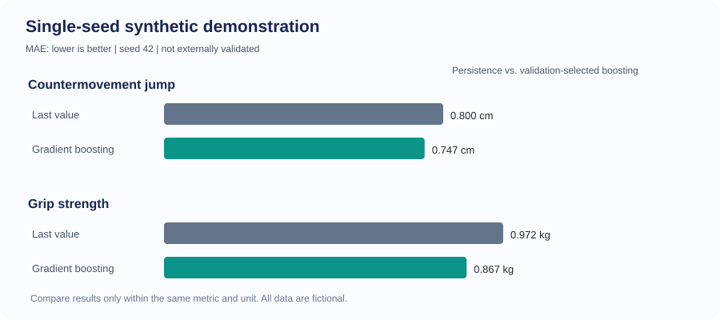
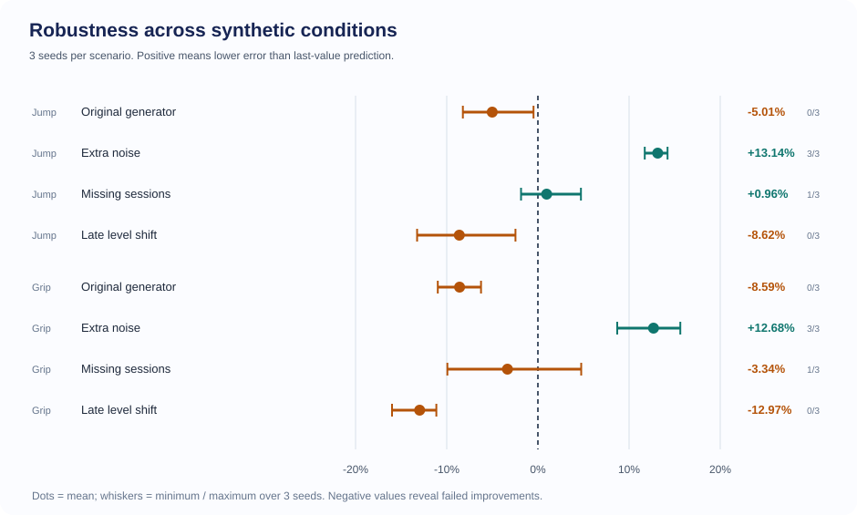
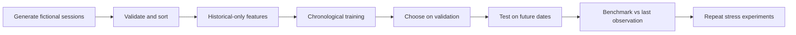

# Athlete Performance Intelligence

**Independent applied-machine-learning research prototype** · Python · Pandas · scikit-learn · time-series evaluation

> **Research status:** All included measurements are fictional. This project is not connected to TMX, includes no client records, and makes no injury-detection or real-world prediction claims.

## Research question

Can historical athlete testing measurements predict the next observed result more accurately than simply repeating the last result? Under which conditions does additional machine-learning complexity **hurt** rather than help?

### Fixed-seed demo (synthetic data)

The initial 120-athlete, 32-week synthetic run (seed 42) selected histogram gradient boosting and recorded **6.65% lower MAE on countermovement jump** and **10.78% lower MAE on grip strength** relative to persistence. These are illustrations only: other seeds did not consistently reproduce the advantage.



### Stress tests: successes and failures

Three additional predetermined seeds (11, 17 and 23), 48 athletes, 26 weeks, two metrics and four synthetic perturbations:

| Condition | Jump: mean change in MAE | Grip: mean change in MAE |
| --- | ---: | ---: |
| Unmodified generator, different seeds | **-5.01%** | **-8.59%** |
| Additional 4% measurement noise | **+13.14%** | **+12.68%** |
| Remove 25% of sessions | **+0.96%** | **-3.34%** |
| Late persistent shift for 30% of athletes | **-8.62%** | **-12.97%** |

**Positive = improvement over last-observation baseline; negative = worse.** The single-seed gains did not generalize consistently across these fictional conditions. The selected method is chosen from validation data, never test data.



See [the complete experiment protocol, limitations and failure analysis](docs/EXPERIMENTS.md), [per-seed results](demo_results/stress/stress_runs.csv) and [summary statistics](demo_results/stress/stress_summary.csv).

## What the code implements

- Historical-only features (three past results, rolling variability, change rate, elapsed days and session index), plus checks for invalid rows and mismatched units.
- Persistence and 3-session-mean baselines alongside Ridge regression and histogram gradient boosting.
- Chronological train/validation/test evaluation, plus a separate split holding out complete athlete identities.
- Athlete-cluster bootstrap uncertainty intervals and historical median/MAD unusual-drop flags, **not medical classifications**.
- A reproducible synthetic stress experiment varying noise, missing visits and late performance shifts.
- Automated tests covering temporal leakage, split separation, evaluation and scenario determinism.



## Reproduce locally

Python 3.10 or later:

```bash
python -m venv .venv
# Activate your virtual environment, then:
python -m pip install -e '.[dev]'
pytest -q
athlete-insights demo --out outputs/demo
python -m athlete_insights.stress --out outputs/stress
```

The **demo** generates a synthetic dataset, forecast comparisons, held-out-athlete results, bootstrap intervals, sample unusual-drop flags, charts and a full report. The **stress command** generates per-seed CSVs, scenario summaries and plots. Smaller reference artifacts appear under [demo_results](demo_results); the exact time/date and disjoint-athlete splits are in [splits.json](demo_results/splits.json).

### Authorized real data (future work)

```bash
athlete-insights analyze --csv path/to/authorized_deidentified_sessions.csv --out outputs/real
```

Input schema: `athlete_id,session_date,test_id,value,unit`. Each athlete/test/date must be unique; each test must have one consistent unit. The current design needs sufficient repeated measurements and at least 12 distinct feature-eligible testing dates. **Do not export, commit or analyze real client records without permission, privacy safeguards and appropriate authority.** Pseudonymous records are not necessarily anonymous.

There is **no real-world validation yet**. Future work must identify an appropriately licensed longitudinal dataset, freeze the evaluation protocol, and report performance across real cohorts and failure cases. Pre/post-only public sports datasets cannot be treated as full longitudinal training histories.

## Limits and interpretation

- Synthetic trajectories may be easier to predict because they were generated with simplified patterns.
- The model predicts the *next observed measurement* using preceding measurements, not an entire training season.
- The athlete-held-out experiment probes a different question than the chronological test; neither constitutes an external validation.
- Bootstrap confidence intervals on fictional subjects quantify sampling variability within the simulation, not field accuracy.
- No athlete injury, fatigue or medical inference is supported by the current evidence.
- No paid API, production deployment, private TMX data or automatic GitHub Actions workflow is required.

**Current status:** methods prototype with documented synthetic successes **and failures**. Suitable to discuss as an ongoing independent coding/research project, not as a validated ML product.
